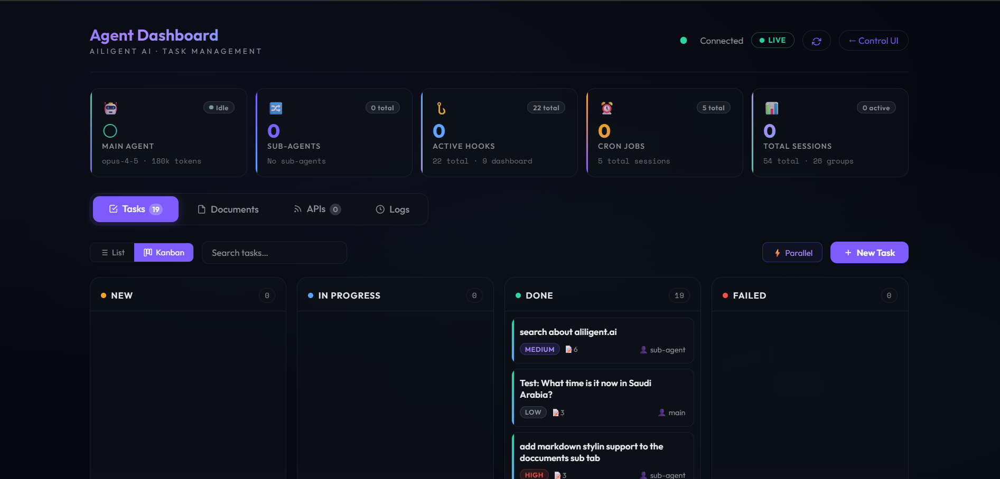
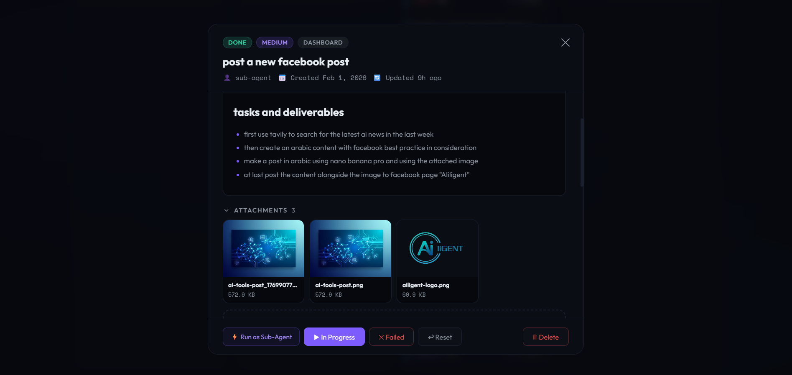
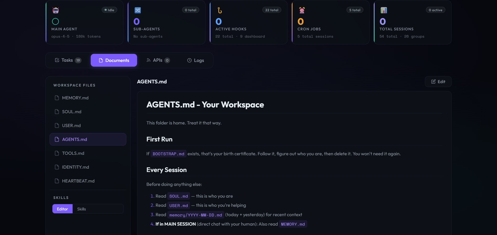
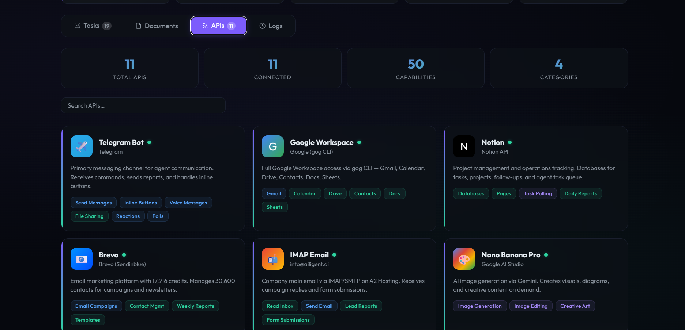
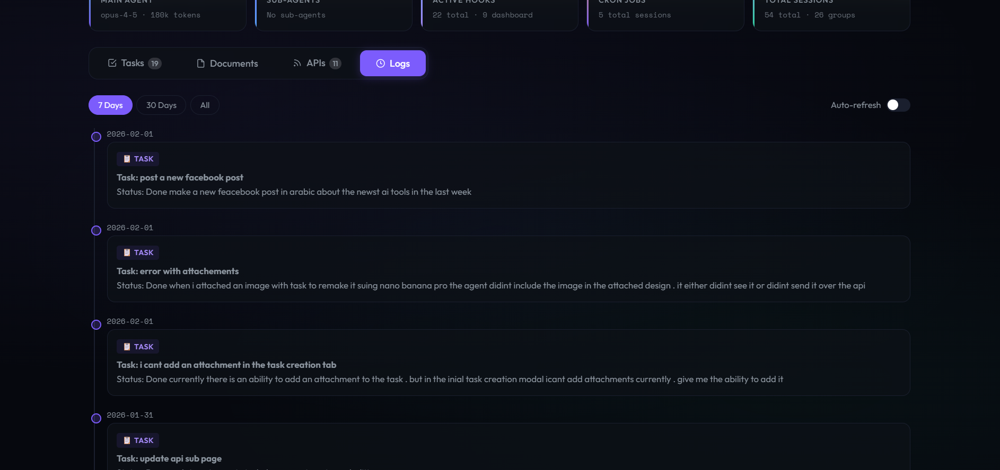

<div align="center">

# OpenClaw Agent Dashboard

**Glassmorphic agent management dashboard for OpenClaw**

[](LICENSE)
[](https://github.com/openclaw/openclaw)
[](https://abo-elmakarem.netlify.app)

A full-featured, single-file agent management dashboard with task kanban boards, document editor, API monitoring, real-time agent tracking, and server metrics — all in a dark glassmorphic UI.

</div>

---

## Demo

[screen-capture.webm](https://github.com/user-attachments/assets/af27872e-68f8-4a60-a586-c3882572d79b)

## Screenshots

<table>
  <tr>
    <td></td>
    <td></td>
  </tr>
  <tr>
    <td align="center"><strong>Tasks — Kanban Board</strong></td>
    <td align="center"><strong>Task Detail — Markdown & Attachments</strong></td>
  </tr>
  <tr>
    <td></td>
    <td></td>
  </tr>
  <tr>
    <td align="center"><strong>Documents — Workspace Files</strong></td>
    <td align="center"><strong>Connected APIs</strong></td>
  </tr>
  <tr>
    <td></td>
    <td></td>
  </tr>
  <tr>
    <td align="center"><strong>Agent Logs</strong></td>
    <td></td>
  </tr>
</table>

## Features

### Agent Dashboard (`agent-dashboard.html`)

- **Task Management** — List & Kanban views with drag-and-drop, status filters (New / In Progress / Done / Failed), priority badges, bulk actions, and parallel task execution
- **Document Editor** — Markdown-powered document viewer/editor with real-time preview, file attachments, and syntax highlighting
- **API Monitoring** — Visual cards for 11 connected integrations (Telegram, Google Workspace, Notion, Brevo, IMAP, Whisper, and more) with capability tags and status indicators
- **Agent Monitor (Logs)** — Real-time log streaming with level filters, session tracking, token usage stats, and auto-scroll
- **Live Dashboard Header** — Main agent status, sub-agent count, active hooks, cron jobs, and total session metrics at a glance
- **Active Sessions Panel** — Collapsible list of running sessions with type badges (MAIN / HOOK / CRON), token counts, and last-active timestamps

### Server Monitor (`server-monitor.html`)

- **CPU / Memory / Disk / Network** — Real-time gauge cards with color-coded progress bars
- **Uptime & Load Average** — System uptime display with 5m/15m load averages
- **CPU & Memory History** — Canvas-drawn 5-minute sparkline charts with live updates
- **System Info** — Hostname, OS, kernel, architecture, and platform details
- **Process Table** — Top processes sorted by CPU/memory usage
- **Auto-refresh** — Polls `/metrics` endpoint every 5 seconds

## Tech Stack

| Layer | Technology |
|-------|-----------|
| Markup | Single-file HTML (zero build step) |
| Styling | CSS3 with glassmorphism, custom properties, gradients, `backdrop-filter` |
| JavaScript | Vanilla ES6+ with async/await, no framework dependencies |
| Markdown | [marked.js](https://github.com/markedjs/marked) (CDN) |
| Fonts | [Outfit](https://fonts.google.com/specimen/Outfit) + [Space Mono](https://fonts.google.com/specimen/Space+Mono) |
| Charts | Native Canvas API (server monitor sparklines) |

## Installation

### Drop into OpenClaw (recommended)

Copy the HTML files into your OpenClaw `control-ui` directory:

```bash
cp agent-dashboard.html ~/openclaw/dist/control-ui/
cp server-monitor.html ~/openclaw/dist/control-ui/dashboard.html
cp favicon.svg ~/openclaw/dist/control-ui/
```

Then access via your OpenClaw gateway:

```
https://your-server/agent-dashboard.html?token=YOUR_TOKEN
https://your-server/dashboard.html?token=YOUR_TOKEN
```

### Standalone with Nginx

Serve the files from any web server and proxy API requests to your OpenClaw instance:

```nginx
server {
    listen 443 ssl;
    server_name agent.example.com;

    root /var/www/dashboard;
    index agent-dashboard.html;

    location /tasks { proxy_pass http://127.0.0.1:18789; }
    location /files { proxy_pass http://127.0.0.1:18789; }
    location /agents { proxy_pass http://127.0.0.1:18789; }
    location /skills { proxy_pass http://127.0.0.1:18789; }
    location /metrics { proxy_pass http://127.0.0.1:18790; }
}
```

### Any Web Server

These are plain HTML files — just serve them with any HTTP server:

```bash
# Python
python -m http.server 8080

# Node.js
npx serve .

# PHP
php -S localhost:8080
```

## API Compatibility

The dashboard connects to standard OpenClaw REST endpoints:

| Endpoint | Used By | Purpose |
|----------|---------|---------|
| `GET /tasks` | Agent Dashboard | Fetch task list |
| `POST /tasks` | Agent Dashboard | Create new tasks |
| `PATCH /tasks/:id` | Agent Dashboard | Update task status/details |
| `GET /files` | Agent Dashboard | List documents |
| `GET /agents` | Agent Dashboard | Agent status & sessions |
| `GET /skills` | Agent Dashboard | Available agent skills |
| `GET /metrics` | Server Monitor | CPU, memory, disk, network stats |

Authentication is handled via `?token=` query parameter, read dynamically from the URL.

---

## 📱 Mobile & Remote Access

This fork adds **browser-native authentication**, **mobile-first UI**, and **macOS auto-start** — making the dashboard easy to monitor from your phone via a secure public URL.

### What's added

| Feature | Details |
|---|---|
| 🔐 Login page | `/login` — HTML form, 30-day cookie session, no manual token in URL |
| 📱 Mobile bottom nav | Fixed tab bar at bottom for thumb-friendly navigation on phones |
| 🍎 PWA support | `Add to Home Screen` works on iOS Safari — feels like a native app |
| 📡 Static serving | `GET /` serves `agent-dashboard.html` directly — no separate web server needed |
| 🔎 System skills scan | `/skills` now discovers both workspace *and* system-installed OpenClaw skills |
| 🔄 macOS auto-start | LaunchAgent plist keeps the server alive across reboots |

### Quick start with Tailscale Funnel (recommended for macOS)

[Tailscale Funnel](https://tailscale.com/kb/1223/funnel) gives you a permanent public HTTPS URL without port forwarding or a separate cloud server.

```bash
# 1. Install Tailscale (if not already)
brew install tailscale

# 2. Start the dashboard
export OPENCLAW_AUTH_TOKEN="your-secret-token"
export OPENCLAW_WORKSPACE="$HOME/.openclaw/workspace"
node api-server.js &

# 3. Expose publicly via Tailscale Funnel (one-time setup)
tailscale funnel --bg 18791

# Your dashboard is now live at:
#   https://<your-machine>.tail-xxxxx.ts.net/
```

Open that URL on your phone → sign in with your token → bookmark it. Done.

### macOS auto-start (LaunchAgent)

Copy `macos/com.openclaw.dashboard.plist.example` to `~/Library/LaunchAgents/`, fill in your username and token, then:

```bash
launchctl load ~/Library/LaunchAgents/com.openclaw.dashboard.plist
```

The server will now start automatically on login and restart if it crashes.

---

## Author

<table>
  <tr>
    <td>
      <strong>Abo-Elmakarem Shohoud</strong><br>
      <a href="https://abo-elmakarem.netlify.app">Portfolio</a> ·
      <a href="https://github.com/karem505">GitHub</a> ·
      <a href="https://linkedin.com/in/abo-elmakarem">LinkedIn</a>
    </td>
  </tr>
</table>

## License

[MIT](LICENSE)
